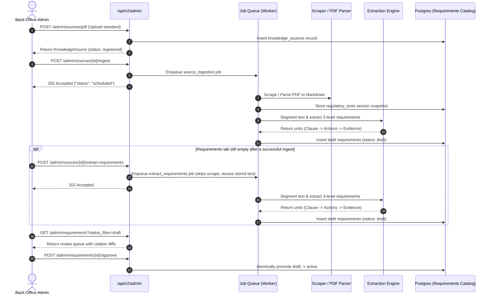

# Back-Office Admin App V2 — Auth Setup & API Guide

**Document:** `docs/BACKOFFICE_ADMIN_GUIDE_V2.md`  
**Audience:** Back-office frontend development team and platform administrators.  
**Scope:** V2 Administration of Regulatory Knowledge Sources and the 3-Level Requirements Catalog (Rainforest Alliance, Fairtrade, EUDR).

---

## 1. Overview & Separation of Responsibilities

The back-office admin app is a dedicated administration tool used to curate the **Regulatory Source of Truth**. Customer dossiers never directly interact with raw standards; instead, the system references an admin-approved, 3-level requirements catalog.

| Responsibility | Owner | Reference |
|---|---|---|
| Provisioning founder/admin accounts | **Backend / Ops Team** (operator script, SuperTokens Core) | §2 |
| CORS allow-listing admin origin | **Backend / Ops Team** (configures `ALLOWED_ORIGINS`) | §2 |
| **Admin Sign-up & Session Management** | **✅ Back-Office Client App** (SuperTokens frontend SDK) | §3 |
| **Attaching the session to every call** | **✅ Back-Office Client App** (handled by the SDK, not manual) | §3 |
| **Managing Sources & Reviewing Requirements** | **✅ Back-Office Client App** | §4 |

---

## 2. Infrastructure Setup (Backend / Ops Reference)

Auth is SuperTokens, not Supabase — there is no Supabase-Dashboard-style "create
an account with a temp password" flow. Provisioning an admin is two steps,
done once per person per SuperTokens Core (staging and prod currently share
one Core — see `docs/DEPLOYMENT_ARCHITECTURE.md` §4 — so provisioning against
either makes that person admin on both):

1. **The admin signs up themselves first**, through the back-office app's own
   normal EmailPassword (or Google) sign-up flow, choosing their own password.
   Self-service sign-up is the only account-creation path — nobody else can
   create the account for them.
2. **Backend/Ops then flags that existing account as admin:**
   ```powershell
   python scripts\provision_admin_supertokens.py <admin@email.com>
   ```
   This sets `usermetadata: {"role": "admin"}` on their SuperTokens account.
   `app/supertokens_config.py`'s session override reads this into every new
   session's access-token payload as the `role` claim (existing sessions are
   NOT retroactively upgraded — the admin must sign in again after this runs).
   Safe to re-run. If the account lives on staging's SuperTokens Core (no
   public endpoint), this script needs an SSM port-forward through the
   migration bastion first — see `docs/DEPLOYMENT_ARCHITECTURE.md`.
3. **CORS:**
   The back-office web origin must be added to `ALLOWED_ORIGINS` in backend
   environment configuration.
4. **Email verification is required** (`EmailVerificationClaim`, mode
   `REQUIRED`) before ANY session-guarded route works, admin ones included —
   the admin must click the verification link SuperTokens emails them
   post-sign-up before `provision_admin_supertokens.py`'s effects are usable.

---

## 3. Client Authentication Plumbing

### 3.1 SDK Configuration
The back-office app initializes SuperTokens' frontend SDK
(`supertokens-auth-react` or `supertokens-web-js`) against:
- `apiDomain`: this backend's public URL (e.g. `https://staging-api.digba-tech.com`).
- `apiBasePath`: `/auth` (SuperTokens' own routes, distinct from `/api/v2`).
- `websiteDomain`: the back-office app's own origin.

There is no anon/public key to embed — SuperTokens has no equivalent of
Supabase's `SUPABASE_ANON_KEY`.

### 3.2 Session Attachment
The SDK attaches the session automatically (an HttpOnly cookie by default) to
every request it makes — there is no manual `Authorization: Bearer <token>`
header to construct, unlike the old Supabase flow. Don't hand-roll fetch/axios
calls that bypass the SDK's interceptor, or the session won't be sent.

`apiDomain` and `websiteDomain` are different origins in staging/prod (the
back-office app does not share a host with this API) — this is a cross-origin
setup, so the SDK's interceptor (cookies + anti-CSRF header) is required;
plain `credentials: "include"` on a hand-rolled fetch is not sufficient.

### 3.3 Getting the Admin's Display Name/Email
There is no `/me` identity endpoint, and none is needed: `role`, `email`,
`name`, and `picture` (the latter two only for Google sign-ins, `None`
otherwise) are stamped onto every session's access-token payload at creation
(`app/supertokens_config.py`'s `override_session_functions`). Read them
client-side via the SDK's `getAccessTokenPayloadSecurely()` — no round trip
to the backend is needed to render them in the app shell.

### 3.4 Auth Screens
This backend's SuperTokens `init()` is configured for a **custom-built**
auth UI, not SuperTokens' prebuilt `supertokens-auth-react` components
(`website_base_path="/"` in `app/supertokens_config.py` routes
verification/password-reset email links straight at the frontend's own
routes, on the assumption those routes exist). Build sign-in/sign-up/verify
screens against `supertokens-web-js`/the raw SDK calls (`signInPOST`, etc.)
to keep the existing branded login screen, rather than mounting the
prebuilt UI.

### 3.5 Gating the App Shell Itself (not just individual calls)

A valid session is NOT the same as an admin session — SuperTokens' sign-up/
sign-in has no concept of "this account may use the back-office app"; ANY
email can authenticate against it (becoming an admin is the separate,
manual `provision_admin_supertokens.py` step in §2). This is by design and
will not change backend-side, so the back-office app itself is the only
place a non-admin can be turned away before reaching the dashboard.

Check the session's `role` claim (§3.3's `getAccessTokenPayloadSecurely()`,
no round trip needed) immediately after a session is established — on
every app-shell/route load, not just at sign-in — and redirect anything
other than `role === "admin"` straight to an access-denied screen (or back
to sign-in) BEFORE rendering the dashboard shell or firing any `/api/v2/
admin/*` calls. Relying on those calls' `403`s (§3.6 below) alone means a
non-admin customer account can browse the dashboard shell and navigate
between empty-looking screens — every actual admin action still correctly
403s server-side (`require_admin` on every route, no exceptions), so no
data is ever exposed, but it's a confusing dead-end experience that reads
as "I got into the admin portal" and shouldn't be reachable at all.

### 3.6 Handling Session/Claim Errors
- **401** (`try_refresh_token` / `unauthorised`, SuperTokens' own session-expired
  shape): the SDK's interceptor refreshes the session transparently in most
  cases; a genuine 401 after that means the user needs to sign in again.
- **403 with body `{"message": "invalid claim", "claimValidationErrors": [...]}`**:
  the `st-ev` claim id means email verification is still pending (§2.4) — route
  the user to SuperTokens' verify-email flow, not a generic error page.
- **403 with a plain message** (no `claimValidationErrors`): a verified,
  authenticated non-admin session hit an admin-only route (`require_admin`) —
  this is a real authorization failure, not a claim issue.

---

## 4. Admin API Reference (`/api/v2/admin`)

All routes require a valid SuperTokens session (attached automatically per
§3.2) whose access-token payload's `role` claim is `"admin"` (stamped via
`usermetadata`, see §2). No session/an expired session → `401`; a valid
non-admin session → `403` (see §3.6 for telling the two apart, and §3.5 for
why the app shell shouldn't wait until this point to turn a non-admin away).

### 4.1 Requirements Review (`/api/v2/admin/requirements`)

The requirements review gate is where raw LLM extractions from standards are verified and approved before becoming live for customer audits.

| Method | Path | Description |
|---|---|---|
| GET | `/admin/requirements` | List requirements with optional filters (`standard`, `status_filter=draft\|active\|deprecated`). |
| GET | `/admin/requirements/{id}` | Retrieve a requirement and its source citation (`{requirement, citation}`). |
| PATCH | `/admin/requirements/{id}` | Edit a `draft` requirement before approval (`RequirementEdit`). Only accepted while `status == "draft"` — `403`/error otherwise. |
| POST | `/admin/requirements/{id}/approve` | Atomically promote `draft` $\rightarrow$ `active`, superseding any previous active version of the same `requirement_key`. |
| POST | `/admin/requirements/{id}/reject` | Deprecate a draft with an audit reason (`{"reason": "..."}`). |

> [!NOTE]
> `action_id`/`evidence_id` inside `actions`/`evidence_checklist` are plain
> strings with no server-side generation or per-row uniqueness enforcement —
> the LLM extractor assigns its own (`act_<native_code>_<n>`,
> `evi_<native_code>_<n>`) at draft time, but nothing stops the client from
> assigning its own (e.g. a client-generated UUID) for a newly-added row.
> `PATCH .../{id}` replaces the whole `actions`/`evidence_checklist` array —
> there is no per-row save endpoint, so the editor can be pure
> local-state-then-PATCH-the-whole-array.

#### Data Models

```ts
// 3-Level Requirement
Requirement = {
  id: string,                      // UUID
  requirement_key: string,         // e.g. "rainforest_alliance:1.1.1"
  standard: "rainforest_alliance" | "fairtrade" | "eudr",
  native_code: string,             // e.g. "1.1.1"
  version: string,                 // e.g. "2020-v1.3"
  title: string,                   // French title
  text: string,                    // Verbatim requirement text from standard
  section_ref: string | null,      // e.g. "Principe 1: Gestion"
  applies_to: {
    sectors: string[],             // e.g. ["cocoa"]
    operating_countries: string[], // e.g. ["CI"]
    export_regions: string[],      // e.g. ["EU"]
    certifications: string[]       // e.g. ["rainforest_alliance"]
  },
  check_kind: "document_presence" | "deterministic" | "llm",
  check_code: string | null,       // Required if check_kind="deterministic"
  expected_evidence: {
    document_types: string[],
    hint: string | null
  },
  criticality: "core" | "mandatory" | "improvement",
  due_year: number | null,         // 0 = immediate, 1+ = phased
  
  // V2 Level 2: Actionable To-dos
  actions: Array<{
    action_id: string,
    title: { fr: string, en: string },
    description?: { fr: string, en: string } | null,
    mandatory: boolean,
    order: number
  }>,
  
  // V2 Level 3: Evidence Checklist
  evidence_checklist: Array<{
    evidence_id: string,
    name: { fr: string, en: string },
    document_types: string[],
    weight: "formal" | "lightweight",
    guidance?: { fr: string, en: string } | null,
    hint?: string | null
  }>,
  
  status: "draft" | "active" | "deprecated",
  reviewed_by: string | null,
  reviewed_at: string | null,
  rejection_reason: string | null,
  source_id: string | null,
  regulatory_text_id: string | null,
  created_at: string,
  superseded_at: string | null
}

// Editable Fields (PATCH body)
RequirementEdit = {
  title?: string,
  text?: string,
  section_ref?: string | null,
  applies_to?: AppliesTo,
  check_kind?: "document_presence" | "deterministic" | "llm",
  check_code?: string | null,
  expected_evidence?: ExpectedEvidence,
  criticality?: "core" | "mandatory" | "improvement",
  due_year?: number | null,
  actions?: RequirementAction[],
  evidence_checklist?: EvidenceItem[]
}
```

> [!IMPORTANT]
> Identity fields (`standard`, `native_code`, `requirement_key`, `version`) cannot be modified via `PATCH`. Changing a requirement's identity requires an explicit re-extraction or remap.

---

### 4.2 Knowledge Sources (`/api/v2/admin/sources`)

Manage source regulatory documents and trigger automated background extraction.

| Method | Path | Description |
|---|---|---|
| GET | `/admin/sources` | List registered knowledge sources (`active`, `standard`, `source_type`). |
| POST | `/admin/sources` | Register a new URL-based source (`KnowledgeSourceCreate`). |
| POST | `/admin/sources/pdf` | Upload and register a PDF standard (`multipart/form-data`). |
| GET | `/admin/sources/{id}` | View single source metadata. |
| PATCH | `/admin/sources/{id}` | Update metadata (`applies_to`, `scrape_frequency`, `deep_crawl`, `is_active`). |
| POST | `/admin/sources/{id}/activate` | Enable source for compliance analysis. |
| POST | `/admin/sources/{id}/deactivate` | Disable source from compliance analysis. |
| POST | `/admin/sources/{id}/ingest` | **Enqueue ingestion job** (scrape $\rightarrow$ Markdown $\rightarrow$ 3-level requirement extraction). Returns `202 Accepted`. |
| POST | `/admin/sources/{id}/extract-requirements` | Force re-extraction against the source's **currently stored** text, bypassing `/ingest`'s "unchanged since last scrape" gate. Use when `/ingest` reports success but Requirements stays empty (e.g. a certification was tagged after the first scrape). Returns `202 Accepted`. |
| GET | `/admin/sources/{id}/ingest-status` | Check status of the latest ingestion attempt (`last_scraped_at`, `last_scrape_error`). |
| GET | `/admin/sources/{id}/texts` | View versioned text snapshots (`content_hash`, character offsets). |
| GET | `/admin/sources/monitoring` | Operational health dashboard across all knowledge sources. |
| GET | `/admin/sources/vocabulary` | Permitted dropdown values (`source_types`, `scrape_frequencies`, `applies_to`). |

`POST /admin/sources` and `/admin/sources/pdf` now enqueue ingestion
automatically right after registration — no separate `/ingest` click
needed, and `source_ingestion.ingest` itself now uses a freshly-inferred
certification (when none was tagged yet) to decide whether to enqueue
extraction, instead of only ever looking at what was tagged BEFORE the
scrape. The full pipeline (scrape → infer context → extract requirements →
gap-sweep) runs on its own for a newly-registered source; `/ingest` and
`/extract-requirements` remain for re-running it manually (e.g. after a
correction, or a scheduled re-scrape).

### 4.3 Job Queue (`/api/v2/admin/jobs`)

The back-office's replacement for fixing a stuck/failed job over a bastion
SQL session — every ingestion/extraction/gap-sweep/document/analysis job
(`app/services/jobs/queue.py`) lands in this same table, admin-visible.

| Method | Path | Description |
|---|---|---|
| GET | `/admin/jobs` | Recent jobs, newest-updated first. `?status_filter=running,error` to surface anything stuck or failed; omit for everything. `?limit=` (default 100). |
| POST | `/admin/jobs/{id}/retry` | Reset a job — stuck `running`, terminal `error`, or even still-`pending` — to a fresh `pending` attempt (`attempts` resets to 0). |

A job can end up stuck `running` forever if the process executing it was
killed outright (not a normal failure) — e.g. an ECS task replaced for
failing health checks, an OOM kill, a deploy interrupting a still-running
task. Suggested panel: poll `GET /admin/jobs?status_filter=running,error`
periodically, flag anything `running` whose `updated_at` is more than a
few minutes old as "looks stuck," and offer the retry button on it — the
backend already self-heals this after 15 minutes (`reclaim_stale_jobs`,
migration 030), so the button is for "I don't want to wait," not a
required step.

#### Ingestion Workflow



---

## 5. Bilingual Standard Ingestion Guidelines

1. **Source Document Languages:**
   - Regulations may be ingested in English (e.g. Rainforest Alliance official English manual) or French (e.g. Ivorian decree, Fairtrade French version).
   - The extraction engine detects the language and produces bilingual metadata (`fr` and `en`) with **French as the primary reference language** for display to cooperatives.
2. **Quality Verification in Review:**
   - Always inspect `GET /admin/requirements/{id}` citation before approving.
   - Verify that Level 2 `actions` are concrete operational tasks for the cooperative.
   - Verify that Level 3 `evidence_checklist` items specify accepted `document_types` from the controlled vocabulary.
